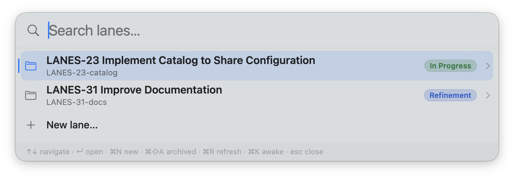

# Lanes

A keyboard-first macOS launcher for switching between parallel work **lanes**.
Each lane is just a folder — Lanes turns it into a hub for its repos, tickets, and quick actions, all an **⌥Space** away.



## What it does

- **⌥Space** opens a floating launcher from the menu bar — no Dock icon, no window in the way.
- It lists your **lanes** (every folder under a root you choose), each with its description and a status badge. Open, create, rename, archive, and fuzzy-search them by name or description.
- **Inside a lane** you get its **tickets**, its **repositories** (each with per-repo actions like Open PR or Open Terminal), and any custom **scripts** — every action either focuses an existing window or launches a new one.
- **Search** spans the whole subtree, surfacing nested actions with a breadcrumb (`service-api › Open PR`).
- Share and update actions, hooks, and templates across a team via **catalogs** — git repos of shared config you subscribe to in Settings.

A lane's description, status badge, hooks, custom scripts, and catalogs are all configured under `<root>/.lanes/` — see **[doc/CONFIGURATION.md](doc/CONFIGURATION.md)** for the full reference.

## Architecture

Four layers (`Lane` → `Item` → `LaneProvider` → `Services`).
Persistence is folder-based: a lane is a directory and its metadata lives in `.lane/`.
All app-managed state for a root sits under `<root>/.lanes/`: archived lanes move to `.lanes/archive/`, and an optional `.lanes/config/template/` folder seeds the contents of every newly created (or externally adopted) lane.

## Build & run

Requires Xcode 26 / Swift 6, macOS 15+.
The single SPM dependency ([KeyboardShortcuts](https://github.com/sindresorhus/KeyboardShortcuts)) resolves automatically on first build.

**From Xcode (simplest):** open `Lanes.xcodeproj` and press **⌘R** to build and run.

**From the command line:**

```sh
# Build
xcodebuild -project Lanes.xcodeproj -scheme Lanes -configuration Debug \
  -derivedDataPath ./.build build

# Launch the built app
open ./.build/Build/Products/Debug/Lanes.app
```

Or just run **`./build-and-run.sh`**, which builds Debug and launches it.

Lanes is a menu-bar accessory app: launching it adds a **menu-bar icon** and registers the **⌥Space** hotkey — there is **no Dock icon and no window on launch**.
Press ⌥Space to open the launcher panel.

On first launch, choose a **root folder** in Settings (⌘, from the menu-bar icon) — this is the directory whose subfolders become your lanes.
For development you can set `LANES_ROOT=/path/to/lanes` to skip the picker, and `LANES_AUTOSHOW=1` to show the panel immediately:

```sh
LANES_ROOT=/path/to/lanes \
  ./.build/Build/Products/Debug/Lanes.app/Contents/MacOS/Lanes
```

The app is unsandboxed (it runs `git` and drives Chrome / iTerm via Apple Events); the first such action triggers the macOS Automation permission prompt.

## Install

**`./install.sh`** builds a Release `Lanes.app` and installs it (→ `~/Applications`; pass `/Applications` to override), then launches it.
Re-run it to update; enable **Launch at login** in Settings once installed.

## License

Copyright © 2026 Daniel Gehrer. All rights reserved.
Lanes is **proprietary, source-available software — not open source.**
You may use it for personal and internal business purposes under a revocable license; redistribution, derivative works, and resale are not permitted.
See [LICENSE](LICENSE) for the full terms.
